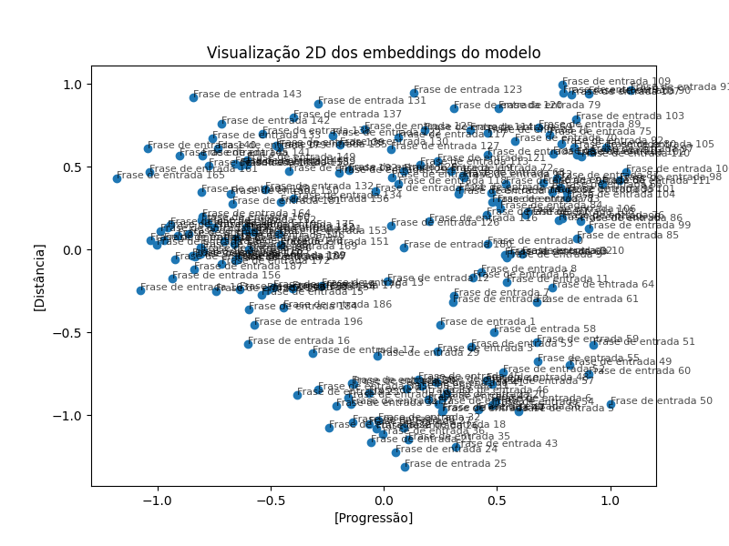

# Modelo de Machine Learning para o projeto GDwho

Este repositório contém a implementação para o sistema que desenvolvi com foco em colocar em prática meus conhecimentos adquiridos em back-end e machine learning no tempo de 1 ano e meio.

## Techs utilizadas
  * fastapi
  * pydantic
  * torch
  * sentence-transformers
  * numpy
  * pandas
  * paraphrase-multilingual-MiniLM-L12-v2

## Rotas
| Verbo HTTP | Rota                                    | Descrição                                           |
|------------|-----------------------------------------|-----------------------------------------------------|
| `POST`     | `/train`                                | treinamento do modelo do usuário                    |
| `POST`     | `/guess`                                | processamento dos palpites no modelo                |
| `GET`      | `/analyze?id=&type=`                    | análise de modelos, parametrização de erros, avaliação de embedding  e validação cruzada |

### Funcionamento

A base do sistema está na criação de embeddings de sentenças, que representam a semântica em vetores numéricos a partir das entradas do usuário (ENTRIES). Quando um palpite é submetido ao modelo, ele é comparado com a lista de dicas (dataList) previamente aprendidas e com os dados de respostas armazenados em cache (REDIS). Esse processo possibilita que o administrador realize análises mais precisas sobre os resultados.

### Gráfico de Desempenho ###

